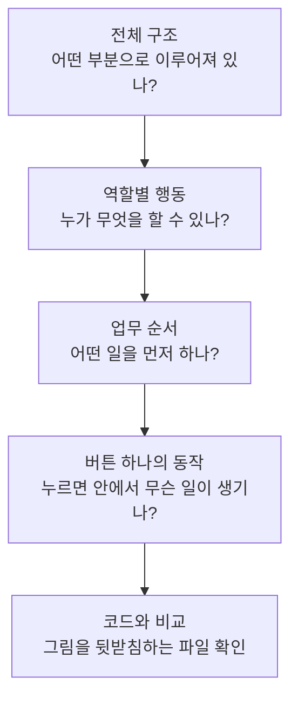

# /archify 목적별 사용 매뉴얼

## 먼저 읽는 용어 정리

### AI와 대화

- **에이전트** == 요청을 받아 자료를 읽고 도구로 작업하는 AI
- **코딩 에이전트** == 이 가이드에서는 Claude Code·Codex·안티그래비티처럼 AI와 함께 코드를 읽고 수정하고 실행하는 프로그램을 뜻함
- **코딩 에이전트 프로그램** == 코딩 에이전트. 이 가이드에서는 같은 뜻으로 사용
- **메인 에이전트(주 에이전트)** == 코딩 에이전트 프로그램 안에서 특정 작업의 사용자 요청을 중심에서 맡고 전체 결과를 정리하는 AI. 여러 작업을 열면 각 작업에 메인 에이전트가 있을 수 있음
- **서브 에이전트** == 메인 에이전트가 나눠 맡긴 일을 처리하는 AI
- **세션** == 하나의 에이전트와 이어지는 대화 흐름. 메시지 한 번이 아니라 여러 질문·답변·작업이 이어지는 구간
- **스킬** == 에이전트가 특정 작업을 할 때 따르는 안내서
- **하네스** == 에이전트가 파일을 읽고 도구를 실행할 수 있게 해 주는 환경
- **컨텍스트** == 에이전트가 지금 참고하는 대화·지침·읽어 온 자료
- **토큰** == AI가 글과 코드를 처리할 때 나누는 작은 조각. 글자 수와 정확히 같지는 않음
- **컨텍스트 용량** == 모델이 한 번에 다룰 수 있는 내용의 한도

### 계획과 작업 관리

**소프트웨어 개발** == 추상적 의도 + 질문을 통한 구체적 결정(기획/기술) + 구현·검증·피드백의 반복

1. **예약 서비스** == “예약을 편하게 하고 싶다” + 예약 시간·취소 규칙·중복 예약 방지 방식 결정 + 구현하고 실제 예약 과정에서 검증·개선
2. **쇼핑몰** == “온라인으로 상품을 팔고 싶다” + 상품 구성·결제 수단·재고 관리 방식 결정 + 구현하고 구매 과정에서 검증·개선
3. **게임** == “친구들과 즐길 게임을 만들고 싶다” + 게임 규칙·참여 인원·실시간 연결 방식 결정 + 구현하고 함께 플레이하며 검증·개선

- **기획 질문 → 기획 결정** == 무엇을 누구를 위해 만들지 묻고 정하는 것. “누가 공지를 작성하나요?” → “학교 공지 담당자 한 명만 작성한다”
- **기술 질문 → 기술 결정** == 정한 기능을 어떤 방법으로 구현할지 묻고 정하는 것. “로그인 상태를 어떻게 유지하나요?” → “30분 토큰을 프론트 메모리에 보관한다”
- **워크플로우** == 상황에 맞게 작업을 이어 가는 순서
- **기획문서** == 누구를 위해 무엇을 만들지 설명한 자료
- **명세** == 어떤 조건에서 어떻게 동작해야 하는지 합의한 구현 기준
- **구현 티켓** == 합의한 기능을 만들고 검사해야 끝나는 작업 카드
- **이슈 트래커** == 질문·작업·담당자·진행 상태를 모아 관리하는 곳
- **CONTEXT.md** == 우리 프로젝트에서 쓰는 업무 용어의 뜻을 적은 파일
- **ADR** == 중요한 설계 선택을 왜 했는지 남긴 기록

### 조사와 개발

- **웨이파인더(wayfinder)** == 그릴위드독스보다 더 알아보고 실험해야 하는 큰 기획에서, 조사·시제품·질문과 답변을 연결해 설계를 구체화하는 스킬
- **트리아지(triage)** == 들어온 요청을 분류하고, 부족한 정보를 확인해 다음 처리를 정하는 일
- **그릴링(grilling)** == 애매한 계획을 질문으로 구체화하고 합의하는 일
- **리서치(research)** == 모르는 사실을 자료와 출처로 확인하는 일
- **프로토타입(prototype)** == 설계 질문에 답하려고 만드는 시험용 모형
- **디버깅(debugging)** == 고장을 재현하고 원인을 찾아 고치는 일
- **재현** == 같은 조건에서 같은 문제가 다시 발생하는지 확인하는 일
- **로그** == 프로그램이 실행하면서 남긴 기록
- **테스트** == 실제 결과가 기대한 결과와 같은지 검사하는 일
- **회귀 테스트** == 변경 후 이전 기능이나 고친 문제가 다시 깨지지 않았는지 확인하는 검사
- **리팩터링(refactoring)** == 사용자가 보는 동작을 유지하면서 코드 내부를 정리하는 일

### 코드 기록과 배포

- **저장소(repository)** == 프로젝트 파일과 변경 이력을 관리하는 곳
- **Git** == 코드의 변경 이력을 관리하는 도구
- **GitHub** == 원격 Git 저장소와 협업 기능을 제공하는 서비스
- **브랜치(branch)** == 같은 프로젝트에서 작업을 따로 이어 가는 이력의 갈래
- **워크트리(worktree)** == 같은 Git 저장소의 작업을 별도로 펼쳐 놓는 폴더
- **커밋(commit)** == 선택한 변경을 Git 이력에 기록하는 일
- **푸시(push)** == 내 커밋을 원격 저장소로 보내는 일
- **PR** == 브랜치의 변경을 검토하고 합쳐 달라는 요청
- **머지(merge)** == 다른 갈래의 변경을 합치는 일
- **충돌** == 서로 다른 변경을 어떻게 합칠지 판단이 필요한 상태
- **빌드(build)** == 코드를 실행·배포할 수 있는 형태로 준비하는 일
- **배포(deploy)** == 새 결과물을 실제 실행 환경에 반영하는 일
- **CI/CD** == 변경 검사와 배포 준비·실행을 자동화하는 흐름. 배포 전 승인 여부는 설정에 따라 다름

### 헷갈리는 용어 비교

| 비교 | 차이 |
| --- | --- |
| **코딩 에이전트 vs 메인 에이전트** | 코딩 에이전트 = 작업에 사용하는 프로그램 전체 / 메인 에이전트 = 그 안에서 특정 작업을 맡는 AI. 프로그램과 작업 담당자의 차이 |
| **세션 vs 메인 에이전트** | 세션 = 이어지는 대화 흐름 / 메인 에이전트 = 그 작업을 중심에서 맡는 AI |
| **메인 vs 서브 에이전트** | 메인 = 전체 요청 담당 / 서브 = 나눠 맡은 부분 담당 |
| **에이전트 vs 스킬** | 에이전트 = 일하는 주체 / 스킬 = 그 주체가 따르는 안내서 |
| **스킬 vs 워크플로우** | 스킬 = 특정 작업의 안내 / 워크플로우 = 작업들을 이어 가는 순서 |
| **세션 vs 컨텍스트** | 세션 = 대화가 이어지는 구간 / 컨텍스트 = 지금 참고하는 내용 |
| **컨텍스트 vs CONTEXT.md** | 컨텍스트 = 지금 참고하는 자료 전체 / CONTEXT.md = 업무 용어를 적은 특정 파일 |
| **컨텍스트 용량 vs 토큰** | 용량 = 한 번에 처리할 수 있는 한도 / 토큰 = 처리량을 세는 조각 단위 |
| **트리아지 vs 그릴링** | 트리아지 = 접수된 요청의 상태와 다음 처리 정리 / 그릴링 = 계획의 모호한 조건을 질문으로 합의 |
| **리서치 vs 그릴링** | 리서치 = 사실 확인 / 그릴링 = 선택할 내용 합의 |
| **트리아지 vs 디버깅** | 트리아지 = 요청을 검토해 다음 처리 정하기 / 디버깅 = 실제 고장의 원인 찾아 수정하기 |
| **grill-with-docs vs wayfinder** | grill-with-docs = 질문하며 설계와 기록을 정리 / wayfinder = 더 알아보고 실험해야 하는 큰 기획에서 조사·시제품·논의를 연결 |
| **기획문서 vs 명세** | 기획문서 = 목적과 원하는 기능 / 명세 = 구체적으로 합의한 동작·검증 기준. 이름보다 실제 내용이 중요 |
| **프로토타입 vs 구현** | 프로토타입 = 판단을 위한 실험 / 구현 = 실제 사용할 기능 만들기 |
| **브랜치 vs 워크트리** | 브랜치 = 작업 이력의 갈래 / 워크트리 = 파일을 펼쳐 놓는 작업 폴더 |
| **저장 vs 커밋 vs 푸시** | 저장 = 파일에 반영 / 커밋 = Git 이력에 기록 / 푸시 = 원격으로 전송 |
| **PR vs 머지** | PR = 검토·합치기 요청 / 머지 = 실제로 변경 합치기 |
| **빌드 vs 배포** | 빌드 = 실행할 결과물 준비 / 배포 = 실행 환경에 반영 |

**기억할 것:** 새 세션에 이전 내용이 모두 자동 전달되는 것은 아닙니다. 서브 에이전트의 작업 완료는 전체 작업 완료와 다르고, 푸시·빌드 성공도 실제 서비스의 정상 동작을 보장하지 않습니다.

### 스킬은 어떤 기능을 묶어놓았나요?

각 행은 **스킬 = 기능 구성**으로 읽으면 됩니다. `+`는 함께 묶인 기능을 뜻합니다. 실제 내부 호출 순서를 뜻하지는 않습니다. 예를 들어 `grill-with-docs`는 `grill-me`를 직접 호출하지 않고, 같은 `grilling`에 `domain-modeling`을 더해 사용합니다.

`research`와 `prototype`은 각각 단독으로도 사용할 수 있습니다. 사실 확인만 필요하면 `research`, 만들어서 확인할 질문이 뚜렷하면 `prototype`, 조사·실험·추가 논의를 연결해야 하면 `wayfinder`를 사용합니다.

| 스킬 | 기능 구성 | 쉽게 말하면 |
| --- | --- | --- |
| `grilling` | 질문 + 사용자 답변 + 모호한 조건 확인 | 애매한 생각을 질문으로 구체화하기 |
| `grill-me` | `grilling` | 질문하며 생각을 구체화하기 |
| `domain-modeling` | 용어 정리 + 중요한 설계 결정 기록(ADR) | 프로젝트의 말뜻과 선택의 이유 남기기 |
| `grill-with-docs` | `grill-me` + `domain-modeling` | 질문하며 구체화하기 + 용어·결정 기록 |
| `research` | 서브 에이전트 조사 + 공식 문서·원본 코드 등 1차 자료 확인 + 출처가 있는 조사 기록 | 모르는 사실을 찾아 근거와 함께 정리하기 |
| `prototype` | 설계 질문 + 시험용 화면·동작 구현 + 직접 사용한 피드백 | 만들어봐야 알 수 있는 것을 작게 실험하기 |
| `wayfinder` | `grill-with-docs` + 필요할 때 `research` + 필요할 때 `prototype` + 결정을 위한 준비 작업 + 결과를 반영한 추가 논의 | 더 알아보고 실험해야 하는 큰 기획을 구체화하기 |
| `to-spec` | 기존 논의 정리 + 동작·설계 결정·검증 기준 명세화 | 합의한 내용을 구현 기준으로 문서화하기 |
| `to-tickets` | 명세·계획 분해 + 작업별 완료 조건 + 선행 작업 연결 | 하나씩 만들고 확인할 구현 작업으로 나누기 |
| `codebase-design` | 모듈 책임·인터페이스 설계 + 구조를 판단하는 공통 기준 | 코드를 어디서 나누고 어떻게 연결할지 정하기 |
| `tdd` | 실패하는 테스트 + 통과시키는 구현 + 리팩터링 | 테스트를 먼저 쓰고 작은 단위로 구현하기 |
| `implement` | 구현 + 가능한 곳에서 `tdd` + 마무리 `code-review` | 만들고 테스트하고 검토하기 |
| `code-review` | 코딩 규칙 검토 + 명세 일치 검토 | 프로젝트 규칙을 지켰는지와 요청한 대로 만들었는지 확인 |
| `triage` | 요청 분류·상태 관리 + 필요할 때 `grill-with-docs`에 해당하는 논의·기록 | 들어온 요청을 정리하고 부족한 조건을 구체화 |
| `improve-codebase-architecture` | 코드 구조 조사 + `codebase-design` + 개선 후보 제안 + 선택한 후보에 대한 논의·기록 | 구조를 살펴보고 무엇을 어떻게 개선할지 정하기 |

## 초간단 요약

**1. 전체 스킬 설치** — 터미널에 붙여 넣습니다.

```powershell
npx --yes skills@latest add tt-a1i/archify --global --skill "*" --agent codex claude-code --copy --yes
```

설치 후 Claude Code·Codex를 완전히 종료하고 다시 실행합니다. 그래도 스킬이 보이지 않으면 설치 상태를 확인하고 PC를 재부팅합니다.

**2. 알고 싶은 프로젝트 폴더를 열고 대화창에 입력합니다.**

```text
/archify 처음 보는 사람이 이해할 수 있도록 이 프로젝트의 전체 구조를 그려줘.
실제 코드를 읽고 각 부분이 하는 일과 연결을 표시해줘.
확인하지 못한 내용은 따로 표시하고, 열어볼 수 있는 HTML 파일로 만들어줘.
```

**3. 그림을 열고 궁금한 부분을 더 자세히 요청합니다.**

```text
/archify 방금 그림에서 저장 버튼을 누른 뒤 일어나는 일을 자세히 그려줘.
화면 → 서버 → DB → 화면 갱신 순서와 실패했을 때의 처리를 보여줘.
```

처음에는 **전체 구조 → 역할별로 할 수 있는 일 → 업무 순서 → 버튼 하나의 동작** 순서로 보면 됩니다. 아래 12개 예시 중 지금 궁금한 것을 골라 복사하세요.

## 이 매뉴얼로 할 수 있는 일

프로젝트에서 **무엇을 알고 싶은지**에 따라 바로 복사해서 사용하는 프롬프트 모음입니다. `/archify`는 프로그램의 연결, 일이 진행되는 순서, 데이터가 이동하거나 바뀌는 과정을 그림으로 만듭니다. 결과는 브라우저에서 열고 살펴볼 수 있는 HTML 파일입니다.

> **쉬운 비유:** 처음 간 학교에서 교실 이름만 나열한 종이보다 위치와 이동 경로가 표시된 지도가 보기 쉽습니다. Archify는 코드 파일만 줄줄이 읽는 대신 ‘어디에서 무슨 일을 하고 서로 어떻게 연결되는지’ 보여주는 지도를 만드는 도구입니다.

> 아래 12개 예시는 학생·교사·문제배정·몰입일지를 다루는 **교육 운영 프로젝트용 요청문**입니다. 실제 구현을 확인한 설명이 아닙니다. 해당 프로젝트를 작업 폴더로 열고 실행하세요. 이 저장소에는 튜토리얼 문서만 있으므로 교육 서비스 코드나 외부 PDF 서버의 존재를 확인할 수 없습니다.

## 설치 방법

### 먼저 알아둘 말: 스킬과 실행 환경

`archify`는 **스킬**, 즉 구조도를 만드는 절차와 자료·보조 프로그램을 묶은 작업 안내서입니다. Claude Code 같은 코딩 도구의 **하네스**는 모델이 파일을 읽고 프로그램을 실행해 결과를 만들도록 돕는 환경입니다.

> **미술실 비유:** 스킬은 ‘학교 안내 지도 그리는 법’이라는 실습 안내서, 하네스는 책상과 도구가 준비된 미술실입니다. 실제 프로젝트를 조사하고 그림을 만드는 과정이 있어야 결과물이 나옵니다. 설치만 했는데 학교 지도가 완성되는 것은 아닙니다.

먼저 **Git과 Node.js LTS(npm·npx 포함)**를 설치합니다. GitHub 저장소·PR을 CLI로 다룰 예정이면 **GitHub CLI(`gh`)**도 설치하세요. 설치 링크는 [게시판 튜토리얼의 필수 도구 안내](README.md#시작-전-필수-설치)에 있습니다.

터미널에서 확인합니다.

```powershell
git --version
node --version
npm --version
```

### 전체 스킬을 Codex·Claude Code에 자동 전역 설치

아래 명령 하나를 실행합니다. 저장소에서 발견한 **모든 스킬**을 **사용자 전역**에 설치하며, **Codex와 Claude Code 모두**에 확인 질문 없이 복사합니다. [Archify 설치 안내](https://tt-a1i.github.io/archify/start.html), [Skills CLI 옵션](https://github.com/vercel-labs/skills)

```powershell
npx --yes skills@latest add tt-a1i/archify --global --skill "*" --agent codex claude-code --copy --yes
```

| 옵션 | 의미 |
| --- | --- |
| `npx --yes` | 패키지 실행 확인 생략 |
| `--global` | 사용자 전역 설치, 여러 프로젝트에서 사용 |
| `--skill "*"` | 해당 저장소에서 발견한 전체 스킬 |
| `--agent codex claude-code` | 두 에이전트를 설치 대상으로 지정 |
| `--copy` | 각 대상 위치에 파일 복사 |
| 마지막 `--yes` | 설치 확인 질문 생략 |

Claude Code는 기본적으로 `~/.claude/skills/`에 설치됩니다. `.agents/skills` 같은 공용 위치뿐 아니라 Claude용 위치도 확인하세요. `~`는 사용자 홈 폴더이며 Windows의 기본 예시는 `C:\Users\사용자명`입니다. 별도 경로 설정이 있다면 설치기가 출력한 실제 위치를 확인합니다.

> **쉬운 비유:** 스킬 세트 전체를 개인 보관함에 넣고, Codex와 Claude가 각각 사용할 위치에 복사하는 것입니다. 프로젝트를 바꿀 때마다 설치 과정을 반복하지 않아도 됩니다.

### 설치 확인과 첫 사용

**설치 후에는 Claude Code와 Codex를 완전히 종료한 뒤 다시 실행하세요.** 실행 중인 작업을 먼저 저장하고 앱이나 터미널 세션을 다시 엽니다. 설치기가 출력한 경로에 `archify/SKILL.md`가 있는지 확인하고, 재시작한 에이전트의 스킬 목록에서 `archify`를 찾습니다.

그래도 인식되지 않으면 설치 경로와 설치 성공 여부를 확인한 다음 **PC를 재부팅하고 다시 확인하세요.** 재부팅 후에도 보이지 않으면 설치 오류나 대상 경로 문제를 확인해야 합니다.

분석할 코드 저장소를 열고 다음을 입력합니다.

```text
/archify 이 프로젝트의 전체 구조를 그려줘.
현재 코드에 근거해 주요 구성 요소의 책임과 연결을 표시하고,
확인되지 않은 외부 서비스는 미확인으로 구분해줘.
```

설치는 스킬을 추가하는 단계이고, 위 호출이 실제 다이어그램 생성 요청입니다. Matt Pocock 스킬 설치와는 별개로 진행합니다.

## 시작 방법

### 먼저 코드가 있는 폴더인지 확인하세요

이 `matt-user-guide` 폴더에는 설명 문서가 있습니다. **게시판의 실제 구조를 그리려면 게시판 코드가 있는 폴더를 열어야 합니다.** 빈 폴더에서는 구현된 구조를 확인할 수 없습니다. GitHub 주소를 알고 있는 것과 그 코드를 현재 작업 폴더에서 읽을 수 있는 것도 다릅니다.

게시판 실습을 진행했다면 6강에서 만든 `notice-board`를 그대로 엽니다. 새 폴더·새 대화를 만들 필요는 없습니다. 아직 코드가 없고 완성된 예제를 분석하려면, 프로젝트를 보관할 상위 폴더의 PowerShell에서 한 번 실행합니다.

```powershell
git clone https://github.com/sik2/matt-user-guide-examples.git
cd matt-user-guide-examples
```

새 예제 주소의 접근 여부와 강별 태그는 [게시판 튜토리얼의 확인 상태](README.md#2강-하네스-세팅--setup-matt-pocock-skills)를 참고하세요.

이미 복제했다면 다시 실행하지 말고 그 폴더를 에이전트의 작업 프로젝트로 엽니다. 처음에는 다음 요청으로 작업 위치부터 확인하세요.

```text
현재 작업 폴더의 전체 경로와 파일 목록을 확인해줘.
backend와 frontend의 코드가 있는지 알려주고 아직 수정하지 마.
```

> **쉬운 비유:** 학교 지도를 그리려면 그 학교의 도면을 가져와야 합니다. 지도 그리는 도구만 설치한 빈 책상에는 교실 위치를 알아낼 자료가 없습니다.

코드만 읽어 구조를 그리는 데 앱 실행이 항상 필요한 것은 아닙니다. 실제 버튼 동작이나 응답을 확인하려면 해당 프로젝트의 실행 준비가 추가로 필요합니다. 그림에는 **코드에서 확인한 내용**과 **직접 실행해서 확인한 내용**을 구분해 달라고 요청하세요.

### 요청을 보내고 결과를 여는 순서

게시판 실습의 작업 규칙은 `AGENTS.md`에서 확인합니다. Codex는 이 파일을 읽고, Claude Code는 `CLAUDE.md`의 `@AGENTS.md` 참조를 통해 같은 규칙을 읽습니다. 두 파일 모두 첫 커밋에 포함합니다. `CONTEXT.md`는 업무 용어, ADR은 중요한 설계 결정의 이유를 확인하는 문서입니다. [파일별 사용 상황과 설정 방법](README.md#agentsmd와-claudemd--언제-어떤-파일을-쓰나요)을 참고하세요.

> **학교 지도 비유:** 학생회실을 지도에 그리기 전에 ‘학생회실’이 어디를 가리키는지 용어를 맞추고, 왜 그 건물로 이전했는지도 확인하는 셈입니다. 규칙 안내판과 용어 사전, 이전 결정 기록을 함께 보면 그림의 뜻을 틀리게 전달할 가능성이 줄어듭니다.

자세한 차이는 [게시판 튜토리얼](README.md)의 스킬·하네스, `CLAUDE.md`·`AGENTS.md`, `CONTEXT.md`·ADR 설명에서 이어서 읽을 수 있습니다.

1. 분석할 프로젝트 폴더를 에이전트에서 엽니다.
2. 설치된 스킬 목록에서 `archify`를 확인합니다.
3. 아래 목적에 맞는 프롬프트를 대화창에 붙여 넣습니다.
4. 에이전트가 알려준 HTML 파일 링크를 누르거나, 파일 탐색기에서 해당 파일을 찾아 브라우저로 엽니다. HTML은 브라우저가 화면으로 보여주는 파일 형식입니다.
5. 파일이 어디 있는지 모르겠다면 “생성한 HTML의 전체 경로와 여는 방법을 알려줘”라고 같은 대화에 적습니다.
6. 그림이 나오면 근거·미확인 사항을 함께 읽습니다. 그림 생성만으로 앱이 정상 작동한다고 확인된 것은 아닙니다.

`/archify`는 터미널 명령이 아니라 스킬 호출입니다. 도구가 스킬 선택 UI를 제공하면 해당 스킬을 선택해 요청하세요. `archify`가 설치되어 있지 않다면 설치 출처를 확인해 먼저 설치해야 합니다. Matt Pocock 스킬 묶음에 자동으로 포함된다고 가정하지 않습니다.

설치된 버전 기준으로 다크·라이트 테마, 확대·이동, 검색, 관계 추적, 이미지·SVG 등의 내보내기를 지원합니다. 기본은 움직임 없는 다이어그램이며 발표용 흐름 애니메이션은 별도로 요청합니다. 설명은 한국어로 작성할 수 있지만 그림을 보는 도구의 기본 메뉴는 영어로 표시될 수 있습니다.

## 빠르게 읽는 순서

**아래 12개를 모두 순서대로 실행할 필요는 없습니다.** 공지사항 게시판을 따라 만든 분은 먼저 [게시판 전용 예시](#공지사항-게시판-튜토리얼에-적용하기)를 사용하세요. 학생·담임·몰입일지 예시는 그런 기능이 있는 다른 프로젝트를 위한 것입니다. 없는 기능을 그려 달라고 하면 실제 구조가 아니라 미확인 내용이나 설계 제안이 됩니다.

**전체 구조 → 역할별 권한 → 실제 업무 순서 → 관심 있는 버튼의 내부 동작** 순서로 보면 전체 맥락에서 세부 코드로 자연스럽게 들어갈 수 있습니다.



이 그림은 매뉴얼을 읽는 순서입니다. 실제 프로젝트 구조를 분석해 만든 결과는 아닙니다.

| 알고 싶은 것 | 추천 번호 | 주로 적합한 표현 |
| --- | --- | --- |
| 시스템이 어떻게 연결되는가 | 1 | 구성도 |
| 누가 무엇을 할 수 있는가 | 2 | 역할·화면·권한 관계도 |
| 업무가 어떤 순서로 진행되는가 | 3 | 업무 흐름도 |
| 버튼을 누르면 내부에서 무슨 일이 생기는가 | 4 | 호출 순서도 |
| 로그인과 접근 제한이 어떻게 동작하는가 | 5 | 인증 순서도 |
| 데이터가 어떻게 연결되는가 | 6 | 데이터 관계도와 관계 표 |
| 생성·변경·취소가 무엇을 바꾸는가 | 7 | 상태가 바뀌는 과정을 그린 그림 |
| 숫자와 통계가 어디서 오는가 | 8 | 데이터 흐름도 |
| 기능을 바꾸면 어디까지 영향이 가는가 | 9 | 변경 영향 관계도 |
| 오류 원인을 어디서 찾아야 하는가 | 10 | 진단 흐름도 |
| 무엇을 테스트해야 하는가 | 11 | 테스트 흐름도 |
| 새 기능을 어떻게 추가할 것인가 | 12 | 현재·제안 구조 비교 |

## 1. 프로젝트 전체 파악

처음 보는 프로젝트의 구성 요소와 책임, 연결 경로를 파악합니다.

> **쉬운 비유:** 학교 안내도에서 교무실·도서관·급식실의 위치와 역할부터 확인하는 것입니다. 처음부터 각 교실 책상 배치까지 볼 필요는 없습니다.

```text
/archify 처음 보는 개발자가 이 프로젝트를 이해할 수 있도록
프론트엔드, 백엔드, DB, 외부 PDF 서버의 연결 구조를 그려줘.
각 구성 요소의 책임과 주요 코드 경로를 표시해줘.
현재 코드와 배포 문서에 근거하고, 미확인 사항은 구분해줘.
```

**예상 결과:** 브라우저·API·DB·PDF 서버의 관계와 호출 방향, 각 구성 요소를 구현한 코드 위치가 연결됩니다. PDF 서버가 코드에서 확인되지 않으면 미확인으로 남습니다.

**전 → 후:** 폴더 이름만 아는 상태 → 어떤 기능이 어느 서비스와 파일에 있는지 파악.

## 2. 역할별로 가능한 일 파악

화면 접근과 서버의 권한 검사를 함께 확인합니다.

> **쉬운 비유:** 학생에게 방송실 버튼이 안 보이는 것과, 실제 방송실 문이 잠겨 있는 것은 다릅니다. 화면에서 버튼을 숨겼는지와 서버가 허용되지 않은 요청을 막는지 둘 다 확인합니다.

```text
/archify 학생, 담임, 수학 운영 관리자, 시스템 관리자가
각각 어떤 화면에서 어떤 일을 할 수 있는지 그려줘.
조회·작성·수정 권한과 접근 가능한 학생 범위를 구분하고,
화면에서 숨기는 기능과 서버가 차단하는 기능도 구분해줘.
```

**예상 결과:** 역할 → 화면 → 동작 → 대상 학생 범위의 관계도와 권한 표가 생성됩니다.

**전 → 후:** “관리자니까 가능할 것”이라는 추측 → 화면 표시 조건과 API에서 허용하는 권한 조건을 각각 확인.

## 3. 실제 업무 순서 이해

사용자의 실제 업무를 담당자·데이터·먼저 갖춰야 하는 조건으로 연결합니다.

> **쉬운 비유:** 도서관에서 ‘책 고르기 → 학생증 확인 → 대출 기록 → 책 가져가기’를 따라가는 것입니다. 무엇을 먼저 해야 하고 어느 단계에서 기록이 생기는지 확인합니다.

```text
/archify 학생 등록 → 수강 설정 → 담임배정 → 문제배정 →
종이 풀이 → 채점 → 일일평가 과정을 업무 흐름도로 그려줘.
각 단계의 담당자, 생성되는 데이터, 다음 단계의 조건을 표시해줘.
코드가 강제하지 않는 순서는 필수 절차처럼 표현하지 말아줘.
```

**예상 결과:** 시스템에서 강제하는 단계와 현장에서 수행하는 단계가 구분됩니다. 종이 풀이처럼 코드 밖의 활동은 업무 가정으로 표시됩니다.

**전 → 후:** 메뉴를 각각 알고 있음 → 업무가 이어지는 조건과 데이터 인계 지점을 이해.

## 4. 버튼 하나의 내부 동작 추적

특정 사용자 행동에서 시작해 저장과 화면 갱신까지 따라갑니다.

> **쉬운 비유:** 급식 신청 버튼을 눌렀을 때 신청이 전달되고, 담당자가 확인하고, 명단에 이름이 들어간 뒤, 내 화면에 ‘신청 완료’가 뜨는 과정을 따라갑니다. 버튼 모양보다 버튼 뒤에서 일어나는 일이 궁금할 때 사용합니다.

```text
/archify 담임이 문제배정 화면에서 저장 버튼을 누른 뒤
DB에 배정과 채점 기록이 생성되고 화면이 갱신될 때까지 그려줘.
React 컴포넌트 → API 함수 → Controller → Service → Repository →
DB 순서와 권한 검사, 함께 성공하거나 취소되어야 하는 저장 작업, 실패 시 응답을 포함해줘.
실제 코드에서 생략되거나 추가되는 계층이 있으면 그 구조를 따라줘.
```

**예상 결과:** 호출 순서, 요청·응답, 여러 저장을 함께 성공시키거나 함께 취소하는 범위, 성공 후 화면 갱신과 실패했을 때 이어지는 처리가 나타납니다. 채점 기록의 생성 시점도 실제 구현에서 확인합니다.

**전 → 후:** “저장하면 된다” → 어떤 API가 어떤 조건으로 어떤 데이터를 저장하는지 이해.

## 5. 로그인과 보안 이해

인증 정보가 어디에 있고, 언제 바뀌거나 무효가 되는지 확인합니다.

> **쉬운 비유:** 출입증을 어디에 보관하고 언제 만료되는지, 만료됐을 때 새 출입증을 받을 수 있는지 확인하는 것입니다. 이 프로젝트가 실제로 사용하는 방식을 조사하며, 없는 갱신 기능을 만들어 그리지 않습니다.

```text
/archify 로그인, 첫 비밀번호 변경, 인증 유지, 토큰 만료,
갱신 실패, 로그아웃을 요청과 응답이 오가는 순서를 보여주는 그림로 그려줘.
access token과 refresh 쿠키의 위치, 프록시 통과 경로,
서버의 역할 검사와 학생 데이터 범위 검사를 포함해줘.
요청한 기능이나 토큰·쿠키가 없다면 실제 방식을 표시하고 차이를 설명해줘.
```

**예상 결과:** 브라우저·프록시·서버 간 인증 경로와 만료·재시도·로그아웃의 차이를 확인합니다.

**전 → 후:** 로그인 성공 화면만 확인 → 토큰 보관·갱신·권한 검사의 전체 경로 파악.

## 6. 데이터 관계 파악

업무 용어가 실제 데이터에 어떻게 연결되는지 확인합니다.

```text
/archify 계정, 교사, 학생, 수강, 담임배정, 문제세트,
배정, 채점 기록, 일일평가, 안내, 몰입일지의 관계를 그려줘.
DB에 저장할 대상을 정의한 코드(엔티티)와 DB 구조 변경 기록을 확인해줘.
어떤 값으로 서로 연결되는지, 하나에 여러 개가 연결될 수 있는지 표시하고,
DB 외래 키로 강제하는 관계와 코드에서만 사용하는 관계를 구분해줘.
```

**예상 결과:** ‘학생 한 명에게 여러 수강 기록이 연결된다’처럼 데이터 사이의 관계를 그림과 표로 확인할 수 있습니다. `1:1`은 하나와 하나, `1:N`은 하나와 여러 개가 연결된다는 뜻입니다. 관계가 많으면 학생 정보·문제 배정·평가처럼 나눠 봅니다.

> **쉬운 비유:** 학생 한 명이 도서관에서 여러 권을 빌릴 수 있는 것과 같습니다. 학생 번호는 대출 기록이 누구의 것인지 연결해주는 값입니다. 다만 실제 DB가 잘못된 학생 번호를 막는지, 프로그램만 검사하는지는 따로 확인해야 합니다.

**전 → 후:** 테이블 목록 → 어떤 레코드가 무엇을 참조하고 어디에서 관계가 보장되는지 이해.

## 7. 상태 변경과 예외 규칙 이해

상태값과 데이터 변경, 조회에서 제외되는 조건을 확인합니다.

> **쉬운 비유:** 도서관 책이 ‘대출 가능 → 대출 중 → 반납 완료’로 바뀌는 것과 같습니다. 상태 이름만 보는 것이 아니라, 어떤 행동을 해야 다음 상태로 바뀌는지도 확인합니다.

```text
/archify 문제배정과 채점 기록의 상태가 바뀌는 과정을 그려줘.
배정 생성·취소, 채점 저장·취소가 각각 어떤 상태와 데이터를 바꾸는지,
취소된 배정이 조회·통계에서 어떻게 제외되는지 확인해줘.
저장되는 상태와 계산해서 보여주는 상태를 구분해줘.
```

**예상 결과:** 현재 상태 → 사건·조건 → 다음 상태와 함께 바뀌는 다른 데이터가 표현됩니다. 취소가 삭제인지 상태 변경인지, 통계 제외가 실제 적용되는지도 확인합니다.

**전 → 후:** 상태 이름만 앎 → 어떤 변경이 가능하고 불가능한지, 어떤 데이터를 보여주는지 확인.

## 8. 통계 숫자의 출처 확인

숫자가 계산되는 과정을 원본 입력까지 거슬러 올라갑니다.

> **쉬운 비유:** 반 평균이 80점이라고 할 때 결석한 학생도 인원에 포함했는지에 따라 뜻이 달라집니다. 계산 결과만 보지 않고 어떤 점수를 모아 몇 명으로 나눴는지 확인합니다.

```text
/archify 몰입일지 통계 화면의 숫자가 만들어지는 과정을 그려줘.
입력 항목 → DB의 저장 항목 → 조회 범위 → 평균·비율 계산 →
API 응답 → 표·그래프까지 연결해줘.
기간 기준, 분모, 작성하지 않은 날, 값이 없는 경우(null)의 처리도 실제 코드로 확인해줘.
```

**예상 결과:** 원본 데이터부터 최종 표시까지의 흐름과 계산 규칙 표가 생성됩니다. 계산 예시를 추가하면 실제 데이터와 가상 예시를 구분합니다.

**전 → 후:** 평균값만 보임 → 누구의 어느 기간 데이터로 어떤 분모를 사용했는지 확인.

## 9. 기능 수정의 영향 범위 파악

코드를 바꾸기 전에 수정 대상과 함께 바뀌는 부분를 예상합니다.

> **쉬운 비유:** 급식 신청서에 ‘알레르기’ 칸을 추가하면 종이 양식뿐 아니라 취합 명단과 조리실 전달 내용도 바뀝니다. 화면에 칸 하나만 추가하면 끝나는지, 함께 바꿔야 할 곳을 찾아보는 것입니다.

```text
/archify 몰입일지에 '집중도' 항목을 추가한다고 할 때
수정이 필요한 화면, 타입, API, 검증, 엔티티, DB,
통계, 테스트의 영향 범위를 그려줘.
현재 구조와 변경 제안을 구분하고 코드는 수정하지 말아줘.
```

**예상 결과:** 현재 경로와 제안 경로, 바꿔야 할 요청·응답 약속, DB 구조 변경, 추가할 테스트가 구분됩니다. 점수 범위나 기존 데이터 기본값처럼 아직 정하지 않은 조건도 표시됩니다.

**전 → 후:** 입력칸 하나 추가라는 생각 → 저장·조회·계산·호환성까지 포함한 수정 범위 파악.

## 10. 버그 원인 추적

가능한 원인을 확인 순서와 증거로 정리합니다.

> **쉬운 비유:** 교실 스피커가 안 들릴 때 볼륨·전원·연결선을 차례로 확인하는 점검표입니다. 아직 확인하지 않은 전선을 ‘고장 원인’으로 단정하지 않는 것이 중요합니다.

```text
/archify '담임이 맡은 학생의 몰입일지를 조회할 수 없다'는 상황에서
확인해야 할 요청 경로와 조건을 진단 흐름도로 그려줘.
로그인 역할, 교사 계정 연결, 활성 수강, 현재 담임배정,
API 응답, 화면 오류 처리를 포함해줘.
확인된 사실과 원인 후보를 구분해줘.
```

**예상 결과:** 요청 도착 여부 → 인증·권한 → 관계 데이터 → 조회 결과 → 화면 처리 순으로 조사 경로가 보입니다. 아직 확인하지 않은 경우는 원인 후보로 남습니다.

**전 → 후:** “권한 문제 같다” → 어떤 요청·조건·데이터를 확인하면 원인을 좁힐 수 있는지 파악.

다이어그램 생성만으로 원인이 확정되는 것은 아닙니다. 실제 요청·로그·재현 결과가 필요하면 별도로 조사하고, 접근할 수 없는 증거는 미확인으로 표시합니다.

## 11. 테스트 시나리오 만들기

이미 검증한 행동과 빠진 행동을 비교합니다.

> **쉬운 비유:** 자판기에서 정상 결제만 확인하지 않고 돈이 부족할 때, 품절일 때, 버튼을 두 번 눌렀을 때도 살펴보는 것입니다. 시험 목록이 있는 것과 실제 시험에 통과한 것은 구분합니다.

```text
/archify 몰입일지의 정상·권한 거부·입력 오류·재저장 시나리오를
테스트 흐름도로 그려줘.
기존 테스트를 확인해 검증된 사례와 빠진 사례를 구분하고,
각 사례의 준비 조건, 행동, 기대 결과를 표시해줘.
테스트 코드 존재 여부와 이번에 실제 실행한 결과도 구분해줘.
```

**예상 결과:** 정상·실패 경로와 준비 조건·행동·기대 결과 표가 생성됩니다. 기존 테스트가 있다는 사실과 실제 통과 여부를 따로 표시합니다.

**전 → 후:** 테스트 파일 수만 확인 → 사용자가 할 수 있는 행동과 거부되어야 하는 행동 중 무엇을 아직 확인하지 않았는지 파악.

## 12. 새로운 상담·알림 기능 설계

현재 구현을 출발점으로 새 업무와 데이터 구조를 제안합니다.

> **쉬운 비유:** 학교에 상담실을 새로 만들 때 현재 교실 배치도와 공사 후 배치도를 따로 그리는 것입니다. 이미 있는 시설과 앞으로 만들 시설이 섞이면 준비가 끝났다고 오해할 수 있습니다.

```text
/archify 학생 상담 요청 → 관리자 확인 → 담당 담임 처리 →
상담 결과 기록 → 학생 알림 → 피드백 확인 과정을 설계해줘.
먼저 현재 코드에 존재하는 기능을 확인하고,
현재 구현과 추가할 기능을 별도 구조도로 보여줘.
새로 필요한 데이터, 권한, API와 결정이 필요한 사항을 표시해줘.
코드는 수정하지 말아줘.
```

**예상 결과:** 현재 구조도와 제안 구조도가 나뉘고, 새 상태·담당자·알림 시점·권한·미결정 사항이 표시됩니다.

**전 → 후:** 기능 아이디어 → 합의해야 할 조건과 실제 변경 영역이 보이는 설계 초안.

## 모든 요청에 붙일 수 있는 결과물 옵션

로컬 코드로 확인할 수 있는 것은 파일을 읽어 조사합니다. 실제 배포 상태처럼 외부 정보가 필요한 경우에는 인증된 CLI나 연결된 MCP가 필요할 수 있습니다. **MCP는 도구·자료를 연결하는 표준 방식**이며, Archify 설치만으로 외부 계정 연결까지 생기지는 않습니다.

> **현장 조사 비유:** 학교 건물 도면을 읽는 것과 오늘 체육관 문이 열려 있는지 관리실에 확인하는 것은 다릅니다. 스킬은 조사·그리기 순서를 안내하고, CLI나 MCP는 실제 관리실에 확인할 수 있는 통로입니다. 연락하지 못했다면 ‘열려 있음’으로 그리지 않고 ‘미확인’으로 남깁니다.

아래를 원하는 프롬프트 끝에 붙이면 결과를 다시 검토하고 공유하기 편합니다. 경로는 이 매뉴얼의 제안 규칙이며 스킬의 고정 저장 경로가 아닙니다.

```text
결과는 docs/diagrams/<주제>.html로 저장해줘.
사용한 다이어그램 원본 JSON과 근거 문서도 같은 폴더에 남겨줘.
근거에는 분석한 커밋, 코드 파일 위치, 함수·클래스 이름과 확인한 조건을 기록해줘.
현재 구현, 문서상 설명, 미확인 사항, 변경 제안을 명확히 구분해줘.
한 화면에 너무 복잡하면 전체 그림과 상세 그림으로 나눠줘.
HTML 생성 검증, 브라우저 동작 확인, 그림을 직접 보고 읽기 쉬운지 확인 결과를 각각 알려줘.
실행하지 못한 검증은 미실행으로 기록해줘.
```

`<주제>`는 `login-flow`, `assignment-save` 같은 실제 이름으로 바꿉니다. 공개할 결과물에는 토큰·비밀번호·학생 개인정보를 넣지 않고, 필요한 경우 비식별 예시를 사용합니다.

### 예상 결과물 묶음

```text
docs/diagrams/
├── assignment-save.html          # 열어서 탐색할 그림
├── assignment-save.json          # 다시 생성·수정할 원본
└── assignment-save-evidence.md   # 코드 근거와 미확인 사항
```

실제 생성 과정에서 검증 보고서나 스크린샷이 추가될 수 있습니다. **HTML 생성 성공**, **브라우저 확인**, **그림을 직접 보고 읽기 쉬운지 확인**, **설명 내용의 코드 근거**는 서로 다른 확인 항목입니다.

## 결과를 읽을 때 확인할 것

| 질문 | 확인 포인트 |
| --- | --- |
| 실제 코드를 그렸나? | 확인한 파일·함수 이름·코드 버전이 있는가 |
| 화살표 의미가 분명한가? | 호출·응답·저장·의존 관계를 구분하는가 |
| 권한을 확인했나? | UI 숨김과 서버의 권한 검사가 각각 표시되는가 |
| 빈칸을 추측으로 채우지 않았나? | 없는 기능과 미확인 기능을 구분하는가 |
| 현재와 제안이 섞이지 않았나? | 별도 그림이나 분명한 설명로 나뉘는가 |
| 정상 흐름만 있지 않나? | 실패·취소·만료·재시도 경로가 필요한 만큼 있는가 |
| 너무 복잡하지 않나? | 전체 그림에서 상세 그림으로 이동해 읽을 수 있는가 |

## 공지사항 게시판 튜토리얼에 적용하기

이 저장소의 [게시판 튜토리얼](README.md)을 따라 실제 앱을 만든 뒤에는 교육 도메인 명칭을 게시판 용어로 바꿉니다. 아래는 바로 쓸 수 있는 세 가지 예시입니다.

### 전체 구조와 배포

```text
/archify 공지사항 게시판의 Vite React shadcn/ui 프론트,
Kotlin Spring 백엔드, local H2 파일·test H2 메모리·운영 PostgreSQL,
GitHub Actions, Railway, Cloudflare Pages의 연결을 그려줘.
사용자 요청 경로와 CI/CD 배포 경로를 별도 그림으로 구분해줘.
현재 코드와 워크플로우를 근거로 하고 문서에만 있는 계획은 표시해줘.
```

### 관리자 공지 등록

```text
/archify 관리자가 공지 작성 화면에서 저장을 누른 뒤
JWT 검증, ADMIN 권한 검사, 입력 검증, JPA 저장,
상세 화면 이동과 공개 목록 반영까지 요청과 응답이 오가는 순서를 보여주는 그림로 그려줘.
인증 실패, 권한 부족, 입력 오류가 있거나 저장에 실패했을 때의 처리를 포함해줘.
실제 컴포넌트·API·서비스·테스트 경로를 근거로 표시해줘.
```

### 배포 실패 확인

```text
/archify main 반영 후 게시판의 새 버전이 보이지 않을 때
GitHub Actions 검사, Railway 배포 ID·커밋·health,
Pages 빌드 시 API 주소, Pages 배포 커밋, CORS,
브라우저 응답을 확인하는 진단 흐름도를 그려줘.
배포 명령 성공과 실제 서비스 준비 완료를 구분하고,
접근 가능한 증거와 미확인 원인 후보를 나눠줘.
```

아직 앱 코드가 없다면 “튜토리얼을 근거로 **제안 구조**를 그려줘”라고 요청합니다. 문서만 읽고 실제 서비스가 구현·배포됐다고 표시하면 안 됩니다.

## 자주 사용되는 워크플로우 10개

[Matt 가이드의 10개 워크플로우](README.md#자주-사용되는-워크플로우-10개)를 실제 코드 이해와 연결하는 예시입니다. **각 항목의 세 사례는 가상 실무 상황**이며 이 저장소에서 확인한 시스템이 아닙니다. Archify는 현재 구조나 제안 구조를 그리는 도구입니다. 질문에 대한 합의, 버그 수정, 배포 완료는 각 작업에서 따로 확인합니다. 그림이 판단에 도움이 될 때만 추가하세요.

### 1. 추상적인 기획이나 의도로부터 시작할 때

**상황:** 기획서와 화면 시안은 받았는데 기존 시스템에서 무엇을 바꿔야 하는지 불명확합니다. 먼저 문서와 실제 코드를 대조해 현재 구조와 변경 제안을 나눠 봅니다.

**흐름:** 기획문서·코드 읽기 → 필요하면 `/archify`로 현재·제안 비교 → `/grill-with-docs`로 미정 정책 합의 → 명세·티켓·구현.

- **환불 관리 개편:** 기획서는 상품별 환불인데 코드는 주문 전체 취소만 지원합니다. 현재 취소 경로와 제안한 부분 환불 경로를 나눠 그리고, 쿠폰·배송비 배분과 승인 권한은 미정 질문으로 표시합니다. 그림이 정책을 대신 확정하지 않습니다.
- **견적 승인 화면:** 시안에는 승인 버튼만 있고 승인 후 수정 규칙은 빠져 있습니다. 현재 수정 경로와 제안한 재승인 흐름을 비교하고 담당자가 선택한 정책을 반영합니다. 기획서에 없는 재승인을 확정 요구사항으로 그리지 않습니다.
- **현장 점검 앱:** 사진 3장 첨부 후 제출하도록 기획됐지만 통신 단절 처리는 없습니다. 정상 업로드 경로와 미정인 임시 저장·실패 복구 지점을 표시해 현업 담당자가 답할 질문을 구체화합니다.

```text
/archify 기획문서 docs/planning/refund-v3.md와 현재 환불 코드를 읽고
현재 구현과 기획서의 변경 제안을 별도 그림으로 비교해줘.
각 변경의 문서 절·관련 코드 경로를 표시하고,
부분 환불·쿠폰·배송비·승인 권한 중 문서가 정하지 않은 내용은 미정으로 남겨줘.
```

**판단:** 예시 경로는 실제 기획문서 경로로 바꿉니다. 문서를 읽지 못했다면 내용을 추측하지 않습니다. 그림에서 드러난 미결정은 인터뷰로 해결하며, 이미 명확한 명세라면 전체 인터뷰를 반복하지 않아도 됩니다. 구체적인 개발 요청은 [Matt 가이드 1번](README.md#1-추상적인-기획이나-의도로부터-시작할-때)을 참고하세요.
### 2. 기존 기능의 작은 동작을 바꿀 때

**흐름:** 코드 확인·`/grill-with-docs` → 필요한 경우 영향 경로만 `/archify` → 짧은 명세 → 구현·검증.

- **거래처명 80자 제한:** 입력 → API 검증 → 외부 전송 경로에서 제한이 적용되는 곳을 표시합니다. 81자 거부와 입력 보존은 구현 후 검증합니다.
- **주문 기본 정렬:** 화면 정렬 옵션과 서버 조회·페이지 이동의 연결을 확인합니다. 한 쿼리의 수정으로 명확하다면 그림은 생략합니다.
- **CSV 버튼 표시 누락:** 역할 → 버튼 표시 → 다운로드 API 검사 → 대상 데이터 범위를 그려 화면과 서버 정책이 일치하는지 봅니다.

**판단:** 큰 저장소 안의 작은 변경도 이 흐름으로 충분할 수 있습니다. 조사나 실험이 많이 필요하지 않다면 `/grill-with-docs`로 조건을 정리합니다.

### 3. 화면이나 상태 모델을 실험할 때

**흐름:** 답할 질문 지정 → `/prototype` 또는 최소 연결 실험 → 사람이 결과 확인 → 필요하면 `/archify`로 선택한 흐름 설명.

- **피킹 화면:** 목록형과 한 품목씩 넘기는 시제품을 직접 써 본 뒤, 선택한 화면의 스캔 → 수량 확인 → 완료 흐름을 그립니다.
- **부분 취소:** 세 상품 중 한 상품만 취소한 상태를 시제품에서 확인하고, 허용·금지 전이를 상태도로 정리합니다. 실제 결제 연동 검증과 구분합니다.
- **20MB 업로드:** 실제 테스트 환경에서 프록시 통과를 확인한 뒤 요청 크기·응답·제한 지점을 표시합니다. 시퀀스 그림만으로 업로드 성공을 판정하지 않습니다.

**판단:** Archify 그림은 조작 가능한 UI 시제품이나 실제 연결 실험을 대신하지 않습니다. 실험 결과를 설명하는 데 사용합니다.

### 4. 외부 서비스 제약을 조사한 뒤 결정할 때

**흐름:** `/research` → `/grill-with-docs` → 필요한 경우 `/archify`로 선택안과 확인된 제약 표시 → 명세.

- **기업 SSO:** 공급자의 공식 문서·계약 조건을 확인한 뒤 브라우저·인증 공급자·앱 간 로그인 경로를 그립니다. 미확인 계정 연결 정책은 결정 항목으로 남깁니다.
- **정산 파일 보관:** 저장소의 공식 지원 조건을 조사하고 파일 생성 → 업로드 → 권한 확인 → 다운로드 경로를 제안합니다. 보관 기간과 접근 정책은 따로 합의합니다.
- **예약 알림:** 발송 취소와 결과 통지 지원을 확인한 뒤 예약 변경·취소·발송 결과의 흐름을 그립니다. 공급자마다 다를 수 있는 동작을 추측하지 않습니다.

**판단:** 조사한 사실과 팀의 선택을 구분하고 출처를 연결합니다. 최신 서비스 조건은 실제 조사 시점에 검증합니다.

### 5. 접수된 요청이 여러 종류로 쌓였을 때

**흐름:** `/triage` → 필요한 정보 보완 → 복잡한 경로만 `/archify`로 설명 → 준비된 작업 구현.

- **로그인 불가 12건:** 재현 조건과 오류 응답을 먼저 모읍니다. 서로 다른 인증 경로가 확인되면 경로별로 그림을 나누고 같은 원인으로 섣불리 합치지 않습니다.
- **엑셀 내보내기:** 요청한 열과 권한이 확정되면 데이터 조회 → 가공 → 파일 생성 경로를 그려 작업 범위를 확인합니다.
- **외부 버그 수정 PR:** 외부 PR을 접수 대상으로 관리하는 프로젝트라면 변경 전후 경로를 비교해 검토를 돕습니다. 그림을 그렸다고 수정 검증이나 병합이 끝난 것은 아닙니다.

**판단:** 요청 분류는 triage의 역할이며, 그림은 필요한 설명 자료입니다.

### 6. 운영 오류의 원인을 좁힐 때

**흐름:** `/diagnosing-bugs`로 재현·증거 확보 → 필요하면 `/archify`로 실패 지점 정리 → 수정·재검증.

- **주소 없는 주문의 500:** 실패 요청이 어떤 조회·변환 경로를 지나는지 그리고 로그가 확인한 지점만 확정 표시합니다.
- **특정 API 응답 지연:** DB 쿼리·외부 호출의 관측 시간을 경로에 붙입니다. 소요 시간을 확인하지 못한 연결에는 추정 숫자를 넣지 않습니다.
- **결제 콜백 중복:** 같은 이벤트의 두 요청과 주문 저장 경로를 그려 재현 테스트와 연결합니다. 동시 요청에서 실제로 중복이 차단되는지는 테스트로 확인합니다.

**판단:** 흐름도는 가설과 증거를 정리합니다. 원인을 단정하거나 수정 성공을 입증하는 자료는 실제 로그·재현·검증 결과입니다.

### 7. 변경 때마다 여러 모듈을 함께 고칠 때

**흐름:** `/improve-codebase-architecture`의 조사·후보 보고·grilling → 필요한 기록 보완 → 명세·구현. 별도 설명 자료가 필요하면 `/archify` 추가.

- **배송비 중복 규칙:** 장바구니·주문·견적의 계산 호출을 현재 구조로 그리고, 책임을 모으는 안을 별도 제안으로 표시합니다.
- **저장소 교체:** 업로드·조회·삭제 세부사항이 노출된 호출부를 표시해 무엇을 모듈 안으로 숨길지 논의합니다.
- **할인 테스트 개선:** 현재 내부 함수 테스트와 제안한 공개 동작 테스트의 범위를 비교합니다. 그림이 단순해졌다는 이유만으로 구조가 좋아졌다고 판정하지 않습니다.

**판단:** 구조 개선 스킬 자체가 시각적 보고와 grilling을 포함합니다. Archify나 새 인터뷰를 매번 추가할 필요는 없습니다.

### 8. 현업 담당자의 답이 있어야 결정할 수 있을 때

**흐름:** `/to-questionnaire` → 사람이 전달·답변 수집 → `/grill-with-docs` → 필요한 경우 `/archify`로 합의한 업무 흐름 확인.

- **환불 승인:** 금액별 승인자와 배송 후 예외에 대한 운영팀 답을 받은 뒤 분기도를 그립니다. 미응답 금액 구간은 미정으로 남깁니다.
- **라벨 재출력:** 현장 담당자가 정한 기존 라벨 무효화·중복 스캔 처리 기준을 흐름에 반영합니다.
- **관리자 퇴사:** 고객이 합의한 권한 인계자·승인 절차를 표시합니다. 현재 코드에 없는 복구 경로는 제안으로 구분합니다.

**판단:** 그림으로 질문을 쉽게 설명할 수 있지만 실제 담당자의 답을 대신 만들 수는 없습니다.

### 9. 그릴위드독스보다 더 알아보고 실험해야 할 때

**흐름:** `/wayfinder`로 필요한 조사·시제품·논의 진행 → 실험 결과와 사용자 피드백으로 설계 구체화 → 필요하면 `/archify`로 확인한 구조 설명 → 명세·구현.

**Wayfinder는 질문에 답하는 것만으로 정하기 어려운 큰 기획에서 사용합니다.** 필요한 경우 내부에서 `research`, `prototype`, `grilling`과 `domain-modeling`을 사용하므로, 사용자는 조사 결과를 확인하고 시제품을 써본 뒤 설계 선택에 참여합니다. [영상의 조사·시제품·논의 설명](https://www.youtube.com/watch?v=HVUH5F1FHlM&t=461s)

- **다이어그램 앱의 명령 팔레트:** 검색 화면을 시제품으로 비교하고, 저장한 요소를 다른 문서에서 재사용할 수 있는지 조사·실험합니다. 선택한 검색·복사 흐름이 복잡하면 Archify로 표현합니다.
- **강의 영상에서 짧은 영상 만들기:** 구간 추천과 후보 검토 화면을 실험해 첫 버전의 자동화 범위를 정합니다. 확인한 영상 처리 단계를 그림으로 설명하되, 그림만으로 추천 품질을 판단하지 않습니다.
- **오프라인 현장 점검 앱:** 저장·재전송·충돌 상황을 실험하고 현장 피드백으로 동작을 정합니다. 연결 끊김 → 임시 저장 → 재전송 → 제출 완료 흐름을 그려 합의 내용을 확인합니다.

**선택 기준:** 대화하며 설계를 정리하려면 `/grill-with-docs`, 정해진 실험 하나를 하려면 `/prototype`, 여러 조사와 실험을 연결해 기획을 구체화하려면 `/wayfinder`를 사용합니다. Archify는 그 과정에서 구조와 동작을 설명하는 그림이 필요할 때 추가합니다.

상세 사례와 복사용 요청은 [Matt 가이드 9번](README.md#9-그릴위드독스보다-더-알아보고-실험해야-할-때--wayfinder)을 참고하세요.

### 10. 사람이 처리해야 하는 계정·배포 설정이 남았을 때

**흐름:** 사람이 할 단계 확인 → `/wizard` → 사람의 설정 완료 → 구현·배포 검증 재개 → 필요하면 `/archify`에 확인 결과 반영.

- **DNS 권한 부재:** 도메인 관리자에게 필요한 변경 내용을 안내하고, 실제 조회·HTTPS 확인 후 도메인과 배포 대상 연결을 확정 표시합니다.
- **SSO 관리자 동의:** 고객 관리자 승인 단계를 안내하고 승인 후 로그인 요청이 어디까지 성공하는지 확인합니다. 승인 대기는 실패한 코드와 구분합니다.
- **운영 결제 계정 승인:** 샌드박스와 운영 경로를 분리해 표시합니다. 운영 승인·설정·검증이 남아 있으면 완료 표시를 하지 않습니다.

**판단:** `/wizard`는 사람이 직접 할 일을 위한 Bash 안내 스크립트를 만듭니다. 에이전트가 처리할 수 있는 작업에는 불필요하며, 스크립트 작성만으로 설정 완료가 되지 않습니다.

### 원문 대조와 이 예시의 범위

2026-09-06에 Matt 스킬 원본의 `3cca18b` 커밋에 있는 `SKILL.md` 37개와 설치본이 일치함을 확인했습니다. Wayfinder 설명은 위 영상의 자동 자막과 스킬 원문을 대조했습니다. [상세 점검 결과](README.md#설명을-원문과-대조한-결과)에 확인 근거를 정리했습니다.

Archify는 조사·실험·설계 결과를 그림으로 설명할 필요가 있을 때 사용합니다. 그림을 추가하는 순서는 이 가이드의 활용 제안이며, 실제 동작과 연동은 실험·테스트로 확인합니다.

## 파일은 생겼는데 다음에 무엇을 해야 할지 모르겠다면

| 상황 | 같은 대화에 보낼 요청 |
| --- | --- |
| HTML 파일을 찾지 못함 | “결과 파일의 전체 경로와 클릭할 링크를 알려줘.” |
| 그림에 낯선 기능이 등장 | “이 기능이 실제 어느 코드에 있는지 보여줘. 없으면 그림에서 제외하거나 제안으로 표시해줘.” |
| 너무 많은 상자가 나옴 | “처음에는 화면·서버·DB만 보여주고 세부 내용은 따로 나눠줘.” |
| 코드를 바꾼 뒤 그림이 오래됨 | “현재 코드로 다시 확인해 그림을 갱신하고 달라진 부분을 알려줘.” |

## 결과가 너무 어렵거나 복잡하면 이렇게 요청하세요

```text
/archify 방금 그림을 처음 보는 사람도 읽기 쉽게 다시 정리해줘.
어려운 용어는 풀어 쓰고, 꼭 필요한 용어는 옆에 짧게 설명해줘.
전체 그림에는 중요한 부분만 남기고 자세한 내용은 별도 그림으로 나눠줘.
실제 코드에서 확인한 연결과 아직 확인하지 못한 내용을 유지해줘.
```

**그림이 예쁜지와 설명이 맞는지는 따로 확인합니다.** 코드 근거, 실패했을 때의 처리, 확인하지 못한 내용까지 함께 읽으면 프로젝트를 이해하는 데 도움이 됩니다.

[Matt Pocock 스킬 사용 순서로 돌아가기](README.md#초간단-요약)
